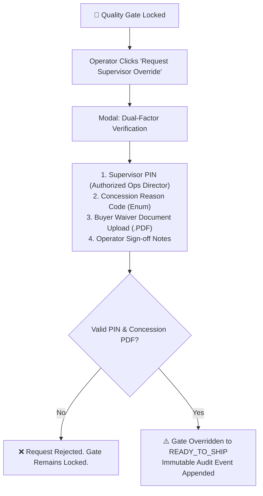

# Rule 01: Hard Quality Gating & Compliance Dossiers

> **Domain Scope**: Quality Control, Logistics Handover, Compliance Auditing  
> **Source Standards**: [Rule 08: Architecture & Decisions](file:///f:/AI-Project/.agents/rules/08-architecture-and-decisions.md) | [Rule 09: Personas & Portals](file:///f:/AI-Project/.agents/rules/09-personas-and-portals.md)

---

## 1. The Hard Quality Gate Principle

In high-precision aerospace, defense, and medical robotics manufacturing, physical parts must never leave origin facilities without complete, verified, and audited quality documentation.

> [!CAUTION]
> **Hard Quality Gate Invariant**:  
> No manufacturing order may transition from state `QUALITY_DOSSIER_COMPLETE` to `READY_TO_SHIP` unless all **6 Mandatory Quality Artifacts** are present, verified against the engineering drawings, and approved by an authorized Quality Inspector.

---

## 2. The 6 Mandatory Quality Artifacts

Every production lot must compile a full Quality Dossier consisting of:

| Artifact | Standard / Specification | Verification Criteria |
| :--- | :--- | :--- |
| **1. Raw Material Test Report (MTR)** | ASTM / AMS (e.g. AMS 4928 for Ti-6Al-4V) | Chemical composition and mechanical tensile/yield tests certified against heat/lot number. Must match alloy specified in 2D drawing title block. |
| **2. AS9102 FAIR (Forms 1, 2, 3)** | SAE AS9102 Rev B/C | Form 1 (Part Number Accountability), Form 2 (Product Accountability - Materials, Special Processes), Form 3 (Characteristic Accountability, 100% ballooned inspection of all drawing dimensions). |
| **3. CMM Inspection Report** | Zeiss / Mitutoyo / Renishaw output | Raw coordinate measurement machine inspection point cloud verifying 100% of critical GD&T features (runout, true position, perpendicularity down to ±5 microns). |
| **4. Special Process Certifications** | Nadcap Accreditations | Hardness testing certificates (heat treatment), anodizing/plating thickness reports (ASTM B244 / ISO 2360), Nondestructive Testing (NDT / Dye Penetrant) records. |
| **5. Certificate of Conformance (CoC)** | ISO/IEC 17050-1 | Official legal declaration of compliance signed and dated by certified Facility Quality Manager. |
| **6. Packaging & Part Marking Inspection** | Mil-Std-130 / Commercial Aerospace | High-resolution photo evidence of permanent part marking (laser etch / dot peen), desiccant packaging, barrier bags, and export-grade crate packing. |

---

## 3. System Lock & UI Banner Behavior

Whenever an order resides in `QUALITY_DOSSIER_COMPLETE` and any required artifact is missing or rejected:

1. **State Transition Lock**:
   - The UI action button `Advance to Ready to Ship` or `Book Freight Dispatch` must be disabled (`disabled="true"`).
   - Any backend API attempt to advance state without verified artifacts must be rejected with HTTP 403 / Domain Validation Exception (`QUALITY_GATE_LOCKED`).
2. **Prominent Alert Banner**:
   - The UI must render the crimson status banner:
   ```html
   <div class="quality-gate-banner quality-gate-banner--locked">
     <div class="gate-status-icon">🔴</div>
     <div class="gate-info">
       <div class="gate-title">DISPATCH LOCKED — Mandatory Quality Artifacts Incomplete</div>
       <div class="gate-subtitle">{approvedCount} of 6 required compliance documents verified. {missingCount} missing.</div>
     </div>
     <div class="gate-missing-tags">
       <!-- Dynamic list of missing/rejected artifacts -->
       <span class="missing-tag">❌ {Artifact Name}</span>
     </div>
     <button class="btn-override-gate">Request Supervisor Override</button>
   </div>
   ```

---

## 4. Supervisor Quality Override Protocol (Exception Workflow)

Under strict circumstances (e.g. pre-approved buyer engineering concession), an order may be unlocked via the **Supervisor Override Protocol**. Bypassing the gate requires dual-factor human authorization:



### Override Data Contract
Every supervisor override must persist:
```json
{
  "override_applied": true,
  "timestamp": "2026-09-02T10:14:00Z",
  "supervisor_id": "OPS-DIR-004",
  "supervisor_name": "Marcus Vance",
  "reason_code": "BUYER_CONCESSION_APPROVED",
  "concession_doc_id": "DOC-WAIVER-88219.pdf",
  "justification": "Buyer QA Lead signed concession for Ra 0.9µm on non-critical sealing surface B.",
  "unlocked_stage": "READY_TO_SHIP"
}
```
Reason code enums:
- `BUYER_CONCESSION_APPROVED`
- `EQUIVALENT_CERTIFICATION_ATTACHED`
- `URGENT_AOG_DIRECT_CONSIGNMENT`
- `TEST_COUPON_RETAINED_FOR_LAB`

---

## 5. Implementation & Code Rules for Agents
- **Frontend Agent**: Never remove or hide the gate lock banner. Disable dispatch buttons until `gateStatus === 'PASSED'` or `gateStatus === 'OVERRIDDEN'`.
- **Architect & Backend Agent**: Implement hard assertions at the state transition layer. Check document presence and status before state commits.
- **QA Agent**: Must write test cases verifying that unverified orders cannot transition to `READY_TO_SHIP`, and that valid overrides write complete audit records.
