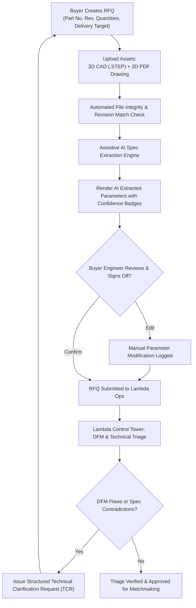

# Workflow 01: RFQ Intake, Asset Ingestion & Assistive AI Triage

> **Category**: Domain Operations Workflow  
> **Key Personas**: Sarah Mitchell (Buyer Procurement Lead), Arjun Mehta (Lambda TME / Control Tower Lead)  
> **Applicable Rules**: [Rule 03: Commercial Shielding](file:///f:/AI-Project/.agents/rules/03-commercial-shielding.md) | [Rule 04: Assistive AI Governance](file:///f:/AI-Project/.agents/rules/04-assistive-ai-governance.md) | [Rule 05: Design System Telemetry](file:///f:/AI-Project/.agents/rules/05-design-system-telemetry.md)

---

## 1. Workflow Architecture & Flow Diagram

---

## 2. Step-by-Step Operational Runbook

### Step 1: RFQ Initialization (Buyer Portal)
1. **Metadata Entry**: Buyer enters Part Number (`AX-204`), Revision (`Rev C`), Description, Annual Forecast vs. Lot Quantities (`5,000`), Target Delivery Date, and Incoterm (`DDP`).
2. **Asset Ingestion**:
   - 3D CAD: `.STEP`, `.STP`, `.IGES`, or `.SLDPRT`.
   - 2D Drawing: Dimensioned `.PDF` with GD&T callouts and title block.
   - Secondary: Bill of Materials (BOM) or quality assurance plan.
3. **Cross-Asset Validation**: System checks that filename part number and revision match across 3D and 2D files.

### Step 2: Assistive AI Parameter Extraction
The AI engine parses the 2D drawing title block, notes, and GD&T balloons:
- **Material Alloy Grade**: (e.g. `Ti-6Al-4V Grade 5 / AMS 4928`)
- **Tolerances**: Tightest linear tolerance (e.g. `±0.015 mm`), critical bore diameter tolerances.
- **Surface Finish**: Roughness average (e.g. `Ra 0.8 µm`), passivation, anodize Type III.
- **Quality & Testing**: Mandates `AS9102 FAIR`, `100% CMM`, `MTR Heat Lot Traceability`.

### Step 3: Human Verification & Confidence Display (Buyer Review)
- Extracted fields are rendered with the Assistive AI Extraction Badge (`ai-badge--pending`).
- Confidence percentage is displayed (e.g. `✨ AI Extracted | 98% Confidence`).
- Buyer Procurement Engineer clicks `Verify` (turns green) or `Edit` to adjust values before formal submission.

### Step 4: Technical Triage & DFM Analysis (Lambda Control Tower)
1. **Queue Priority**: New RFQ lands in Arjun Mehta's `New RFQs Requiring Technical Validation` queue.
2. **Split-Screen Ingestion Inspection**:
   - Left: 3D interactive CAD viewer with rotation, zoom, bounding box metrics.
   - Right: 2D PDF drawing with ballooned feature callouts.
3. **DFM Risk Scanning**:
   - Thin wall detection: Flags walls `< 0.8 mm`.
   - Deep cavity ratio: Flags pockets deeper than `4x` tool diameter.
   - Non-standard threads: Flags unlisted thread pitches or tight tap depths.
   - Contradictions: Flags discrepancies between 3D model geometry and 2D drawing dimensions.

### Step 5: Triage Disposition
- **Clear**: TME marks RFQ as `TECHNICAL_TRIAGE_APPROVED`. Status advances to `MATCHMAKING_READY`.
- **Clarification Needed**: TME sends structured Technical Clarification Request (TCR) with drawing pinpoints back to buyer. RFQ status pauses at `PENDING_BUYER_CLARIFICATION`.
