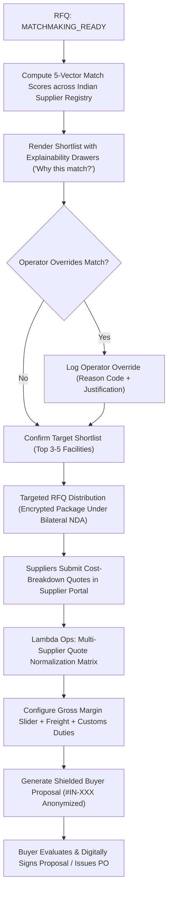

# Workflow 02: Supplier Matchmaking, Quoting & Proposal Generation

> **Category**: Domain Operations Workflow  
> **Key Personas**: Arjun Mehta (Lambda Ops Lead), Rajesh Patel (Supplier Estimating Engineer), Sarah Mitchell (Buyer)  
> **Applicable Rules**: [Rule 03: Commercial Shielding](file:///f:/AI-Project/.agents/rules/03-commercial-shielding.md) | [Rule 04: Assistive AI Governance](file:///f:/AI-Project/.agents/rules/04-assistive-ai-governance.md) | [Rule 05: Design System Telemetry](file:///f:/AI-Project/.agents/rules/05-design-system-telemetry.md)

---

## 1. Workflow Architecture & Flow Diagram

---

## 2. Step-by-Step Operational Runbook

### Step 1: 5-Vector Algorithmic Match Computation
The matchmaking engine scores certified Indian precision machine shops against RFQ parameters:
$$S = 0.25 \cdot C_{mach} + 0.25 \cdot C_{cert} + 0.20 \cdot C_{mat} + 0.15 \cdot C_{otd} + 0.15 \cdot C_{qual}$$
- $C_{mach}$: 5-axis DMG Mori / Mazak envelope matches part bounding box; spindle RPM adequate.
- $C_{cert}$: Active AS9100 Rev D, ISO 9001, Nadcap for drawing-specified treatments.
- $C_{mat}$: History of completed Titanium / Inconel production lots.
- $C_{otd}$: Rolling 12-month on-time delivery rate $> 95\%$.
- $C_{qual}$: Historical defect rate $< 50$ PPM.

### Step 2: Explainability Drawer & Human Review
- Ops Controller clicks any candidate to inspect the **Evidence Card**:
  - ✓ Active AS9100 Rev D verified (Valid thru Nov 2027)
  - ✓ 5-Axis DMG Mori NMV 5000 in-house (Travel 730 × 500 × 500 mm)
  - ✓ 14 past orders completed in Ti-6Al-4V with zero defects
  - ✓ Zeiss Contura CMM with sub-micron scanning probe
  - ✓ 96.4% historical on-time delivery.

### Step 3: Operator Override (If Applicable)
If the operator selects an alternative supplier (e.g., to utilize existing tooling):
- Operator selects reason code: `TOOLING_ALREADY_AVAILABLE`, `CAPACITY_RESERVED`, etc.
- System logs operator ID, timestamp, and notes into immutable audit trail.

### Step 4: Targeted Dispatch & Structured Quoting (Supplier Portal)
Shortlisted suppliers receive drawing packages and submit line-item breakdowns:
1. Raw material billet cost (kg weight × rate/kg minus scrap offset).
2. Spindle machine cycle times (roughing hours + finishing hours × machine rate).
3. Custom tooling, chuck jaws, and fixture investment.
4. Special processes (heat treating, anodizing, passivation).
5. Quality inspection & AS9102 FAIR documentation charge.
6. Target factory dispatch lead time in calendar days.

### Step 5: Multi-Supplier Quote Normalization Matrix
Ops Controller compares incoming bids side-by-side:
- Normalized unit price at volume breaks (1k, 5k, 10k).
- Total lead time to dispatch.
- Deviation notes (e.g. proposed radius change or equivalent stock allowance).
- Risk rating composite.

### Step 6: Margin Engine & Shielded Proposal Generation
1. Ops Controller applies Lambda target gross margin (e.g. 18.5%).
2. Freight, insurance, export/import duties calculated.
3. Commercial shielding applied: Supplier name transformed to `Lambda Certified Facility #IN-402 (Bangalore Precision Aerospace Cluster)`.
4. Proposal transmitted to Buyer with 14-day validity countdown.
