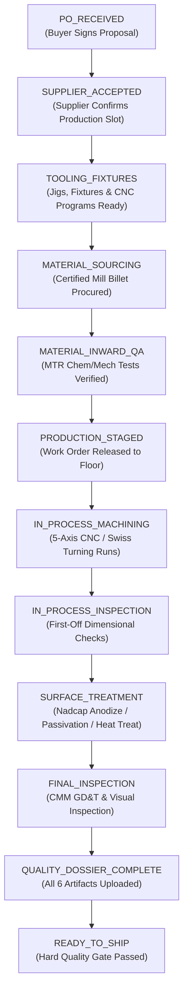

# Workflow 03: Production Execution & 17-State FSM Progression

> **Category**: Domain Operations Workflow  
> **Key Personas**: Vikram Sharma (Plant Operations Manager), Arjun Mehta (Lambda Control Tower)  
> **Applicable Rules**: [Rule 01: Hard Quality Gates](file:///f:/AI-Project/.agents/rules/01-hard-quality-gates.md) | [Rule 02: 17-State FSM](file:///f:/AI-Project/.agents/rules/02-manufacturing-fsm.md) | [Rule 05: Design System Telemetry](file:///f:/AI-Project/.agents/rules/05-design-system-telemetry.md)

---

## 1. Workflow Architecture & Flow Diagram

---

## 2. Step-by-Step Operational Runbook

### Step 1: Order Issuance & Award
- Buyer signs proposal and uploads formal Purchase Order.
- System transitions to state `PO_RECEIVED` and assigns manufacturing order ID (e.g. `ORD-58241`).
- Lambda issues Supplier Work Order with committed delivery milestones.
- Supplier confirms acceptance: state advances to `SUPPLIER_ACCEPTED`.

### Step 2: Tooling, Fixturing & G-Code Simulation
- Supplier CNC programmers generate 5-axis toolpaths and run collision simulations (Vericut).
- Custom aluminum/steel chuck jaws and carbide end mills prepared.
- State advances to `TOOLING_FIXTURES`.

### Step 3: Raw Stock Procurement & Material Inward QA
- Certified aerospace billet sourced with heat/lot number.
- Raw Material Test Report (MTR) uploaded:
  - Chemical composition (e.g., Ti: Bal, Al: 6.1%, V: 4.0%, Fe: 0.18%, O: 0.16%).
  - Mechanical yield & tensile strength verified against ASTM B348 / AMS 4928.
- State advances to `MATERIAL_SOURCING` ➔ `MATERIAL_INWARD_QA`.

### Step 4: Production Staging & Machining
- Work order package printed with physical traveler barcode.
- Raw billet mounted on CNC 5-axis machining center.
- State advances to `PRODUCTION_STAGED` ➔ `IN_PROCESS_MACHINING`.
- Real-time telemetry recorded (spindle hours, part count, scrap counter).

### Step 5: In-Process Inspection & Special Processing
- First-off part removed for dimensional verification on height gauge / micrometers.
- State advances to `IN_PROCESS_INSPECTION`.
- Dispatched to Nadcap-certified special processing partner for surface treatment (e.g., Hard Anodize Type III or vacuum heat treat).
- State advances to `SURFACE_TREATMENT`.

### Step 6: Final CMM Inspection & Quality Dossier
- Parts cleaned, deburred, and placed on Zeiss Contura CMM for 100% critical dimension inspection.
- AS9102 FAIR Forms 1, 2, 3 compiled.
- Certificate of Conformance (CoC) signed by Quality Manager.
- High-resolution packaging photos uploaded.
- State advances to `FINAL_INSPECTION` ➔ `QUALITY_DOSSIER_COMPLETE`.
- **System Locks**: Dispatch is held until Hard Quality Gate is verified (Workflow 04).
