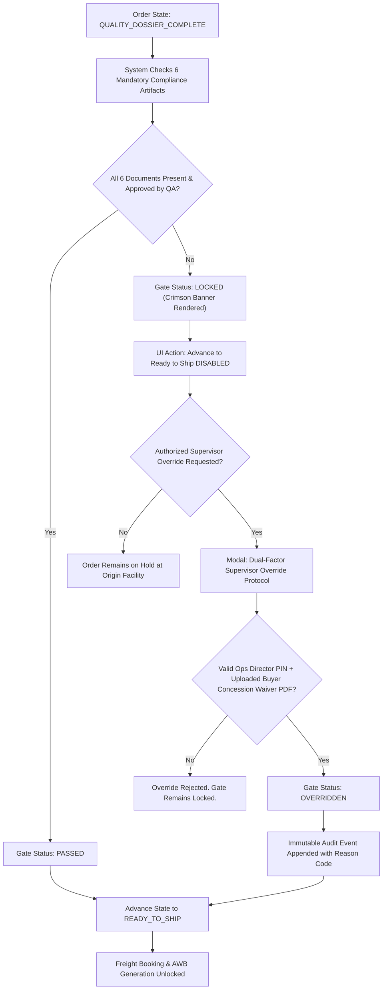

# Workflow 04: Hard Quality Gating, Compliance Audit & Dispatch

> **Category**: Domain Operations Workflow  
> **Key Personas**: Arjun Mehta (Lambda TME / Control Tower Lead), Marcus Vance (Lambda Quality Director)  
> **Applicable Rules**: [Rule 01: Hard Quality Gates](file:///f:/AI-Project/.agents/rules/01-hard-quality-gates.md) | [Rule 02: 17-State FSM](file:///f:/AI-Project/.agents/rules/02-manufacturing-fsm.md) | [Rule 07: Compliance & Audit](file:///f:/AI-Project/.agents/rules/07-compliance-and-audit-trails.md)

---

## 1. Workflow Architecture & Flow Diagram

---

## 2. Step-by-Step Operational Runbook

### Step 1: Quality Dossier Ingestion & Automatic Gate Verification
When an order reaches `QUALITY_DOSSIER_COMPLETE`, the system evaluates the 6 mandatory documents:
1. **Raw Material Test Report (MTR)**: Verifies alloy grade against drawing callout, heat number matching raw stock billet.
2. **AS9102 FAIR**: Verifies Form 1 (Part number / revision), Form 2 (Materials & special processes), Form 3 (100% ballooned characteristics measured).
3. **CMM Inspection Report**: Raw point cloud data confirming all critical GD&T features within tolerance.
4. **Special Process Certs**: Nadcap heat treatment hardness and surface anodizing/plating thickness reports.
5. **Certificate of Conformance (CoC)**: Signed by Certified Quality Manager.
6. **Packaging & Marking Photos**: Clear visual evidence of laser etched part numbers, desiccant bags, and crate packaging.

### Step 2: Quality Review Drawer (Lambda Operations)
- Lambda Quality Engineer opens the **Document Verification Drawer**:
  - Split-screen comparison between drawing requirements and uploaded inspection records.
  - Reviewer applies digital approval stamp or flags document as `REJECTED` with specific defect notes.

### Step 3: Hard Quality Gate Lock Enforcement
- If any document is missing or rejected:
  - System immediately triggers the lock.
  - The UI renders the crimson banner: `🔴 BLOCKED: Mandatory Quality Artifacts Incomplete`.
  - Dispatch booking and shipment generation are strictly disabled.

### Step 4: Supervisor Quality Override Protocol (Exception Flow)
If the buyer grants an engineering concession (e.g., minor non-sealing surface Ra variance):
1. Authorized user clicks `Request Supervisor Override`.
2. System displays the **Dual-Factor Override Modal**:
   - Senior Supervisor PIN authentication.
   - Reason Code selection (`BUYER_CONCESSION_APPROVED`, `URGENT_AOG_DIRECT_CONSIGNMENT`, etc.).
   - Mandatory upload of the signed Buyer Engineering Waiver PDF.
   - Justification notes explaining the disposition rationale.
3. Upon validation, the gate status transitions to `OVERRIDDEN`.
4. Order advances to `READY_TO_SHIP` and records an immutable chronological audit trail entry.
