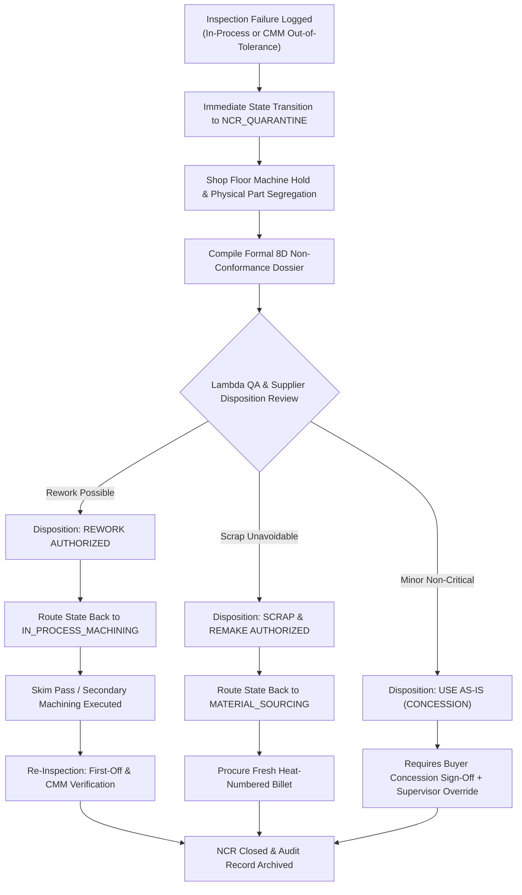

# Workflow 05: Non-Conformance (NCR), 8D Containment & Rework

> **Category**: Domain Operations Workflow  
> **Key Personas**: Marcus Vance (Lambda Quality Director), Vikram Sharma (Supplier Plant Operations Manager)  
> **Applicable Rules**: [Rule 01: Hard Quality Gates](file:///f:/AI-Project/.agents/rules/01-hard-quality-gates.md) | [Rule 02: 17-State FSM](file:///f:/AI-Project/.agents/rules/02-manufacturing-fsm.md) | [Rule 07: Compliance & Audit](file:///f:/AI-Project/.agents/rules/07-compliance-and-audit-trails.md)

---

## 1. Workflow Architecture & Flow Diagram

---

## 2. Step-by-Step Operational Runbook

### Step 1: Discrepancy Detection & Quarantine Transition
1. **Trigger**: An out-of-spec condition is discovered during first-off inspection, in-process checking, or Zeiss CMM scanning (e.g. critical bore measured `10.06 mm` against nominal `10.00 ± 0.02 mm`).
2. **System Action**:
   - Order state immediately changes to `NCR_QUARANTINE`.
   - Dispatch is locked.
   - Plant operations manager receives instant high-priority alert.
3. **Physical Containment**: Defective parts are physically tagged with red quarantine labels and placed in a locked quarantine cage.

### Step 2: 8D Problem Solving Dossier Creation
The supplier QC engineer, supervised by Lambda TME, initiates the formal 8D report:
- **D1 (Team)**: Supplier QC Lead, CNC Machinist, Lambda TME.
- **D2 (Problem Description)**: Part serial numbers, drawing characteristic number, nominal, drawing tolerance, measured dimension, and affected quantity.
- **D3 (Containment Action)**: Quarantined 14 pieces; inspected balance of batch.
- **D4 (Root Cause Analysis)**: 5-Why analysis identifying tool insert wear / thermal deflection during roughing cycle.
- **D5 (Permanent Corrective Action)**: Tool life counter reduced from 150 cycles to 100 cycles; automatic probe cycle added after cycle 80.
- **D6 (Verification of Action)**: Test coupon cut and verified within ±0.004 mm.

### Step 3: Formal Disposition Selection
Lambda Quality Director reviews the 8D report and assigns the binding disposition:

| Disposition | FSM Target Rollback State | Scenario & Action |
| :--- | :--- | :--- |
| **Rework** | `IN_PROCESS_MACHINING` | Oversized material remains. CNC program updated for precision finish skim pass. |
| **Scrap & Remake** | `MATERIAL_SOURCING` | Undersized dimension (too much material removed). New mill billet ordered. |
| **Concession** | `READY_TO_SHIP` (via Override) | Non-critical feature; buyer approves formal engineering concession. |

### Step 4: Re-Inspection & NCR Closure
- Following rework or remake, parts must pass 100% CMM re-inspection.
- The 8D report, updated CMM point cloud, and corrective action proofs are permanently appended to the lot's digital compliance record.
- Order is released from quarantine.
