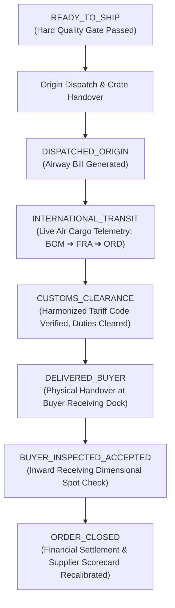

# Workflow 06: Logistics, Customs Clearance, Inward QA & Order Closure

> **Category**: Domain Operations Workflow  
> **Key Personas**: Sarah Mitchell (Buyer Procurement Lead), Arjun Mehta (Lambda Control Tower), Logistics Forwarder  
> **Applicable Rules**: [Rule 02: 17-State FSM](file:///f:/AI-Project/.agents/rules/02-manufacturing-fsm.md) | [Rule 03: Commercial Shielding](file:///f:/AI-Project/.agents/rules/03-commercial-shielding.md) | [Rule 07: Compliance & Audit](file:///f:/AI-Project/.agents/rules/07-compliance-and-audit-trails.md)

---

## 1. Workflow Architecture & Flow Diagram

---

## 2. Step-by-Step Operational Runbook

### Step 1: Origin Handover & Airway Bill (AWB) Generation
- Once Hard Quality Gate passes (`READY_TO_SHIP`), logistics forwarder receives automated pickup manifest.
- Parts inspected for Mil-Std packaging, vapor corrosion inhibitor (VCI) bags, and wooden export crates.
- Package handed over at Bengaluru (BLR) or Mumbai (BOM) air cargo hub.
- System transitions to `DISPATCHED_ORIGIN` and embeds live Airway Bill tracking number.

### Step 2: International Freight Telemetry
- Flight legs tracked in real-time within the Lambda Operations Control Tower:
  - Leg 1: BLR/BOM ➔ Frankfurt (FRA)
  - Leg 2: FRA ➔ Chicago O'Hare (ORD)
- Automated delay prediction flags potential missed connections.
- State: `INTERNATIONAL_TRANSIT`.

### Step 3: Customs Clearance & Harmonized Tariff System (HTS)
- Lambda customs brokerage desk files commercial invoice and packing list.
- HTS Classification verified (e.g. `8803.30.00` for civil aircraft titanium structural components).
- Customs import entry number logged; duties and taxes disbursed.
- State advances to `CUSTOMS_CLEARANCE`.

### Step 4: Buyer Dock Delivery & Proof of Delivery (POD)
- Local freight carrier completes final-mile delivery to buyer's warehouse.
- Buyer receiving dock signs physical Proof of Delivery (POD).
- System transitions to `DELIVERED_BUYER`.

### Step 5: Buyer Inward QA & Digital Acceptance
- Buyer QA Engineer accesses the verified digital Quality Dossier (MTR, CMM, AS9102 FAIR).
- Inward sampling inspection conducted (ANSI/ASQ Z1.4 sampling plan).
- Buyer signs digital acceptance sign-off.
- State advances to `BUYER_INSPECTED_ACCEPTED`.

### Step 6: Order Closure & Supplier Scorecard Recalibration
- Escrow/milestone payment released to Indian supplier.
- Final invoice settlement archived.
- State advances to `ORDER_CLOSED`.
- Supplier performance metrics automatically updated:
  - On-Time Delivery (OTD %) updated.
  - Quality rating (PPM defect rate) recalculated.
  - Machine capability weights refreshed for future matchmaking.
