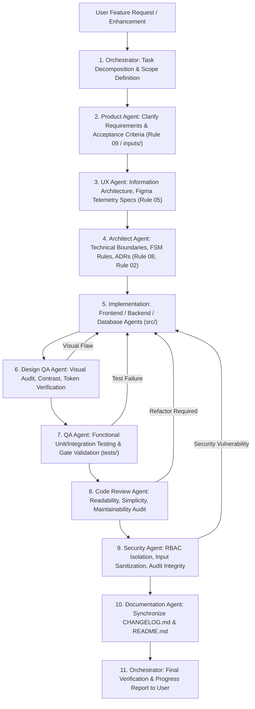

# Workflow 07: Multi-Agent Software Engineering Feature Pipeline

> **Category**: Multi-Agent Engineering Pipeline  
> **Key Roles**: Orchestrator, Product, UX, Architect, Frontend, Backend, Database, Design QA, QA, Code Review, Security, Documentation  
> **Applicable Rules**: [Rule 05: Design System Telemetry](file:///f:/AI-Project/.agents/rules/05-design-system-telemetry.md) | [Rule 06: Agent Roles & Permissions](file:///f:/AI-Project/.agents/rules/06-agent-roles-and-permissions.md)

---

## 1. Pipeline Architecture & Flow Diagram

---

## 2. Step-by-Step Execution Protocol

### Step 1: Orchestrator Ingestion & Planning
- Deconstruct the user request into sequential tasks.
- Pass targeted context from `.agents/rules/`, `.agents/workflows/`, or `inputs/` (avoid dumping unrelated documentation).
- Enforce the active technology stack (no unauthorized external frameworks).

### Step 2: Requirements Specification (Product Agent)
- Writes functional user stories, domain constraints, and acceptance criteria based on project rules and briefs in `inputs/`.
- Permitted target: `.agents/rules/09-personas-and-portals.md`, `inputs/` analysis.
- Concludes with standard handoff to UX Agent.

### Step 3: Information Architecture & Design Tokens (UX Agent)
- Maps user flows, scannability hierarchy, and telemetry tokens.
- Permitted target: `.agents/rules/05-design-system-telemetry.md`.
- Concludes with standard handoff to Architect Agent.

### Step 4: Technical Contracts & Data Flow (Architect Agent)
- Defines state mutations, API endpoints, schema interfaces, and records ADRs.
- Permitted target: `.agents/rules/08-architecture-and-decisions.md`, `.agents/rules/02-manufacturing-fsm.md`.
- Concludes with handoff to Implementation agents.

### Step 5: Implementation (Frontend, Backend, Database Agents)
- **Frontend Agent**: Implements telemetry views, components, and event handlers in `src/` consuming [Rule 05: Design System Telemetry](file:///f:/AI-Project/.agents/rules/05-design-system-telemetry.md) CSS variables.
- **Backend Agent**: Implements route handlers, 17-state FSM transitions, and 5-vector matchmaking calculations.
- **Database Agent**: Implements relational schemas and immutable append-only audit tables.

### Step 6: Design QA Audit (Design QA Agent)
- Audits contrast ratios (WCAG AAA for critical telemetry).
- Verifies monospace fonts applied to part numbers, alloys, and tolerances.
- Checks responsive layout at 1440px, 1280px, and 1024px desktop resolutions.

### Step 7: Quality Assurance & Testing (QA Agent)
- Writes unit and integration tests in `tests/`.
- Validates hard quality gate locks (asserts unverified orders cannot ship).
- Validates that state machine transitions strictly follow sequential invariants.

### Step 8: Code Review (Code Review Agent)
- Audits code readability, simplicity, and architecture adherence.
- Flags unnecessary complexity, premature optimizations, or rule violations.

### Step 9: Security Audit (Security Agent)
- Verifies commercial shielding (ensures no supplier names leak into buyer API payloads).
- Validates supervisor PIN authentication on quality overrides.
- Confirms tamper-resistant audit trail logging.

### Step 10: Documentation Synchronization (Documentation Agent)
- Updates `CHANGELOG.md` with features delivered.
- Verifies cross-document link consistency (`file:///` schemes).

### Step 11: Orchestrator Final Sign-off
- Verifies test execution.
- Generates final user summary highlighting completed milestones.
