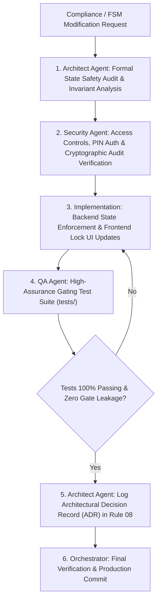

# Workflow 08: Quality Gate & State Machine Change Management

> **Category**: Multi-Agent Engineering Pipeline  
> **Key Roles**: Architect Agent, Security Agent, Frontend Agent, Backend Agent, QA Agent, Orchestrator  
> **Applicable Rules**: [Rule 01: Hard Quality Gates](file:///f:/AI-Project/.agents/rules/01-hard-quality-gates.md) | [Rule 02: 17-State FSM](file:///f:/AI-Project/.agents/rules/02-manufacturing-fsm.md) | [Rule 06: Agent Roles & Permissions](file:///f:/AI-Project/.agents/rules/06-agent-roles-and-permissions.md) | [Rule 07: Compliance & Audit](file:///f:/AI-Project/.agents/rules/07-compliance-and-audit-trails.md) | [Rule 08: Architecture & Decisions](file:///f:/AI-Project/.agents/rules/08-architecture-and-decisions.md)

---

## 1. High-Assurance Change Doctrine

Because Lambda governs aerospace, defense, and medical robotics manufacturing, any change to the **17-Stage Manufacturing FSM**, the **Hard Quality Gate criteria**, or the **Compliance Artifact Verification logic** represents a safety-critical alteration.

> [!CAUTION]
> **Zero-Bypass Policy**:  
> No code change may reduce compliance strictness or introduce bypass mechanisms without an Architectural Decision Record (ADR) and a comprehensive regression test suite proving zero quality leakage.

---

## 2. Pipeline Architecture & Flow Diagram

---

## 3. Step-by-Step Execution Protocol

### Step 1: State Safety Audit (Architect Agent)
- Audits the proposed change against the 17-state sequential lifecycle invariants ([Rule 02](file:///f:/AI-Project/.agents/rules/02-manufacturing-fsm.md)).
- Verifies that intermediate manufacturing stages cannot be skipped.
- Verifies that discrepancy transitions route exclusively through `NCR_QUARANTINE`.
- Updates [Rule 08: Architecture & Decisions](file:///f:/AI-Project/.agents/rules/08-architecture-and-decisions.md).

### Step 2: Access & Security Review (Security Agent)
- Audits the supervisor override dual-factor protocol (Supervisor PIN + Buyer Concession Waiver PDF + Reason Code).
- Verifies that only authorized roles (Operations Director, Senior Quality Lead) hold override permissions.
- Ensures all override actions generate immutable audit log entries with cryptographic hash signatures ([Rule 07](file:///f:/AI-Project/.agents/rules/07-compliance-and-audit-trails.md)).

### Step 3: Enforcement Implementation (Backend & Frontend Agents)
- **Backend Agent**: Implements state transition preconditions and hard exceptions (`QUALITY_GATE_LOCKED`, `UNAUTHORIZED_FSM_TRANSITION`).
- **Frontend Agent**: Updates the crimson lock banner, disabled button states, and override dialog interface ([Rule 01](file:///f:/AI-Project/.agents/rules/01-hard-quality-gates.md)).

### Step 4: High-Assurance Test Suite (QA Agent)
The QA Agent must write automated test assertions validating:
1. `test_order_cannot_advance_without_mtr`: Fails transition if MTR missing.
2. `test_order_cannot_advance_without_fair`: Fails transition if AS9102 FAIR missing.
3. `test_order_cannot_advance_without_cmm`: Fails transition if CMM missing.
4. `test_order_cannot_advance_without_coc`: Fails transition if CoC missing.
5. `test_invalid_pin_rejects_supervisor_override`: Validates dual-factor authentication.
6. `test_successful_override_appends_audit_log`: Verifies immutable event persistence.

### Step 5: Decision Record & Orchestrator Final Sign-off
- Architect Agent documents the rationale in [Rule 08: Architecture & Decisions](file:///f:/AI-Project/.agents/rules/08-architecture-and-decisions.md).
- Orchestrator verifies that all gate-holding test suites pass with 100% green status.
