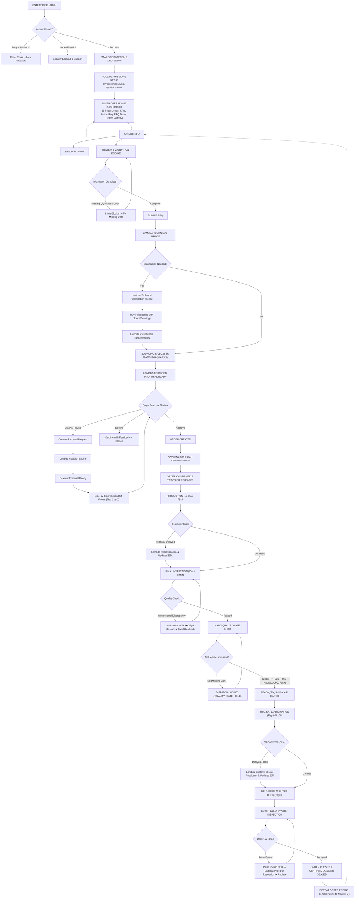

# Workflow 09: End-to-End Buyer Procurement Lifecycle & Exception Architecture

> **Category**: Domain Operations Workflow  
> **Key Personas**: Sarah Mitchell (Buyer Procurement Lead, AeroTech Systems), Arjun Mehta (Lambda TME / Control Tower Lead), Marcus Vance (Lambda Quality Director)  
> **Applicable Rules**: [Rule 01: Hard Quality Gates](file:///f:/AI-Project/.agents/rules/01-hard-quality-gates.md) | [Rule 02: Manufacturing FSM](file:///f:/AI-Project/.agents/rules/02-manufacturing-fsm.md) | [Rule 03: Commercial Shielding](file:///f:/AI-Project/.agents/rules/03-commercial-shielding.md) | [Rule 04: Assistive AI Governance](file:///f:/AI-Project/.agents/rules/04-assistive-ai-governance.md) | [Rule 09: Personas & Portals](file:///f:/AI-Project/.agents/rules/09-personas-and-portals.md)

---

## 1. Master Buyer Workflow Diagram

---

## 2. The 18 Operational Decision Runbooks

### 01: Login & Account Recovery
- **Password Reset**: Buyer enters verified enterprise domain email (`@aerotech.com`). System issues time-bounded SHA-256 reset token.
- **Lockout Rule**: 5 failed consecutive attempts lock user for 15 minutes with ITAR security notification.

### 02: RFQ Draft / Save & Continue Later
- State stored in `draftRfqs` with unique ID, timestamp, completed step index, and payload.
- Dashboard prominently surfaces "Draft RFQs — Resume Later" badge.

### 03: Pre-Submission RFQ Validation Engine
- Hard blockers:
  1. `quantity <= 0`
  2. `material == null`
  3. `cadFile == null` OR `drawingPdf == null`
  4. File revision mismatch (e.g. CAD `Rev B` vs PDF `Rev C`).
- Prevents submission until all blockers clear.

### 04: Bidirectional Technical Clarification Loop
- Clarification requests generated by Lambda Ops (Arjun Mehta) freeze sourcing progression.
- Buyer provides technical response, answers GD&T questions, and re-uploads drawings if needed.
- Re-validation step mandatory before supplier RFQ packet dispatch.

### 05: RFQ Cancellation / Withdrawal
- Can be withdrawn when status is `DRAFT`, `SUBMITTED`, or `CLARIFICATION_REQUIRED`.
- Withdrawal is prohibited when proposals are active or purchase orders have been authorized.

### 06: Proposal 3-Way Decision Architecture
- **Approve**: Authorizes NRE tooling and volume piece price.
- **Clarify / Request Revision**: Submits counter-parameters (target price, lead time compression, lot split).
- **Decline**: Formally archives proposal with structured rejection reason.

### 07: Proposal Revision Comparison & Diff Viewer
- Side-by-side delta visualization:
  - Unit Price Delta (e.g. `$14.50` ➔ `$11.20`)
  - Guaranteed Delivery Days (e.g. `32 days` ➔ `26 days`)
  - NRE Tooling Amortization
  - DFM Exceptions & Special Process coverage.

### 08: Intermediate Supplier Confirmation State
- `ORDER_CREATED` triggers transmission of bilateral shop traveler to Certified Cluster `#IN-XXX`.
- Supplier has SLA of 24h to lock machine capacity ➔ status moves to `ORDER_CONFIRMED`.

### 09: Production At-Risk & Delay Telemetry
- Real-time spindle telemetry monitoring feeds risk algorithm.
- If cycle times or machine maintenance threaten delivery date, status sets to `AT_RISK` and Lambda ops coordinates backup capacity.

### 10: In-Process Quality Issue & Pre-Shipment NCR
- If Zeiss CMM detects out-of-spec dimensions, an origin NCR is raised.
- Parts are reworked/remade and re-measured before proceeding to quality dossier assembly.

### 11: Hard Quality Gate Enforcement (Rule 01)
- Non-negotiable dispatch lock:
  - 1. MTR with heat chemistry
  - 2. AS9102 Rev B FAIR Forms 1–3
  - 3. Zeiss CMM 100% feature scan
  - 4. Nadcap Special Process Certs
  - 5. Lambda Tier-1 CoC
  - 6. Mil-spec ESD packaging photos
- Order cannot advance to `READY_TO_SHIP` without all 6 verified.

### 12: Customs Clearance Exception Telemetry
- International cargo tracking flags US CBP ACE clearance status.
- Classification delays under HTS 8803.30 trigger active Lambda brokerage intervention.

### 13: Buyer Inward Dock QA (Two Paths)
- **Path A (Accept)**: Dock sampling inspection passes ➔ Digital signature ➔ `ORDER_CLOSED`.
- **Path B (Issue Found)**: Discrepancy logged ➔ Origin investigation ➔ Replacement parts expedited under Lambda warranty.

### 14: Classified Documents Vault
- Multi-tier repository storing all artifacts across 6 categories with explicit state tags: `AVAILABLE`, `PENDING`, `LOCKED`, `APPROVED`, `EXPIRED`.

### 15: Controlled Operations Messaging
- Commercially shielded messaging thread connecting Sarah Mitchell directly with Arjun Mehta and Marcus Vance.

### 16: Event-Driven Notification Stream
- Priority alerts for operational milestones, approvals needed, and technical clarifications.

### 17: Repeat Order Cloning Engine
- 1-click clone feature copying all technical drawings, tooling codes, and approved quality plans into a fresh draft RFQ.

### 18: Multi-Role Permission Enforcement
- Role-specific access controls for Procurement, Engineering, Quality, Admin, and Viewer personas.
